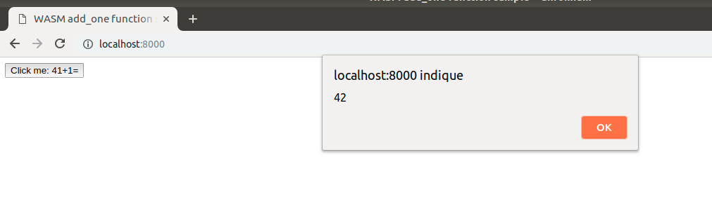

# WASM with Rust: a primer without using `nodejs`
You can refer to the Rust WASM book here: but I found it over complicated to start with. To discover how to use Rust with WASM, I decided to write this little tutorial.

## Rust installation
Refer to https://www.rust-lang.org/ for installation instructions. 

## Add the WASM target
You need to add the WASM target in order to compile Rust to WASM:

```console
$ cargo build --target wasm32-unknown-unknown --release
```

Note that since version 1.30 (??), there's no need to use the nightly `rustc` build.

## WebAssembly

## A simple project

### Create the project structure
This over-simplified project is taken from 
Create the project structure:

```console
# --lib for creating a library instead of a binary
$ cargo new --lib wasm_add_one
```

Edit the `Cargo.toml` file and change it to reflect the follownig:

```toml
[package]
name = "wasm_add_one"
version = "0.1.0"
authors = ["dandyvica <dandyvica@gmail.com>"]
edition = "2018"

[dependencies]

[lib]
crate-type =["cdylib"]

```
Edit the `src/lib.rs` file and replace the existing code:

```RUST
// this is a simple interface without leveraging from the Rust language bells and whistles
#[no_mangle]
pub extern fn add_one(x: u32) -> u32 {
    x + 1
}
```

### Compile to WASM
You can now compile your code with:

```console
# debug: the target is target/wasm32-unknown-unknown/debug/wasm_add_one.wasm
$ cargo build --target wasm32-unknown-unknown
```

or 

```console
# release mode
$ cargo build --target wasm32-unknown-unknown --release
```

### Strip the WASM binary

The compiled WASM is quite large, around 1.4 Mb. To reduce its size, you need to run it throught through `wasm-gc`command. This utility is a small command to gc a wasm module and remove all unneeded exports, imports, functions, etc. (from `crates.io`).

Install `wasm-gc` first:

```console
$ cargo install wasm-gc
```

then strip the WASM code:

```console
$ wasm-gc target/wasm32-unknown-unknown/debug/wasm_add_one.wasm
```

As a result, the file is around 17 Kb.

### Looking at the WAT file
The WAT file is the ASCII representation of the binary WASM. You can convert the binary `.wasm` file to a `.wat` ascii file with the `wasm2wat` command. Follow instructions at https://github.com/WebAssembly/wabt to install the `wabt` toolkit.

Then you could export the binary WASM to the WAT format:


```console
$ wasm2wat wasm_add_one.wasm -o wasm_add_one.wat
```

and check the `add_one` function is exported:

```console
$ grep export wasm_add_one.wat
```

### Glue it with HTML and JavaScript
Create a `www` directory in your Rust project root structure:

```console
$ mkdir www
```

and create an `index.html` file:

```html
<!DOCTYPE html>
<html>
  <head>
    <script src="add.js"></script>
  <head>
  <body>
    <button onclick="add_one(41)">Click me: 41+1=</button> 
  </body>
<html>

```

and create the `add.js` JavaScript file:

```js
// use this JS API to load the WASM module and start using it in a streaming mode
// i.e. without having to wait
WebAssembly.instantiateStreaming(fetch("wasm_add_one.wasm"))
    .then(wasmModule => {
        // this saves the exported function for use in JS
        add_one = wasmModule.instance.exports.add_one;
    });
```

Also, copy the WASM module to your `www` directory to rule out directory hassles:

```console
$ cp ../target/wasm32-unknown-unknown/debug/wasm_add_one.wasm .
```

Examples found in the Rust WASM sites make use of `webpack` and `nodejs` and therefore hide the details. For example, the `import` ES6 statement for import a WASM module is not yet deployed for browsers.

### Run a web server
On Linux, a simple web server is available through Python by:

```console
$ python3 -m http.server
```

but this implementation doesn't include the `application/wasm` mime types needed to import the WASM module.

You can find an example on github gist to handle WASM mime types. Save the following into a `server.py` file:

```python
#!/usr/bin/env python3

import http.server
import socketserver

PORT = 8000

Handler = http.server.SimpleHTTPRequestHandler
Handler.extensions_map.update({
    '.wasm': 'application/wasm',
})

socketserver.TCPServer.allow_reuse_address = True
with socketserver.TCPServer(("", PORT), Handler) as httpd:
    httpd.allow_reuse_address = True
    print("serving at port", PORT)
    httpd.serve_forever()
```

Then starts the web server:

```console
$ python3 server.py
```
Then, start your favorite browser supporting WASM:




## wasm_gen crate
The previous example for exposing a Rust function, but without leveraging from Rust power, like exchanging strings or structures between JS and Rust. In order to achieve that, you'll need to import the `wasm_gen` crate in your `Cargo.toml`.

As stated in https://rustwasm.github.io/wasm-bindgen/ , _this project allows JS/wasm to communicate with strings, JS objects, classes, etc, as opposed to purely integers and floats_.

## Using `wasm_gen`

We're going to modify the `Cargo.toml` file in order to make use of the `wasm_gen` crate:

```toml
[package]
name = "wasm_add_one"
version = "0.1.0"
authors = ["dandyvica <dandyvica@gmail.com>"]
edition = "2018"

[dependencies]

[lib]
crate-type =["cdylib"]

[dependencies]
wasm-bindgen = "0.2.34"
cfg-if = "0.1.6"
```

and edit the `src/lib.rs` file to reflect this:

```rust
extern crate wasm_bindgen;
use wasm_bindgen::prelude::*;

// more idiomatic rust code
#[wasm_bindgen]
pub fn add_one(x: u32) -> u32 {
    x + 1
}

// #[no_mangle]
// pub extern fn add_one(x: u32) -> u32 {
//     x + 1
// }
```

You'll need an additional tool to compile this code to a WASM module:

```console
$ cargo install wasm-bindgen-cli
```

Now, you can compile:

```console
$ cargo build --target wasm32-unknown-unknown --release
```

Next step is to run `wasm-bindgen` to make use of high-level interactions between WASM modules and JavaScript (provided you're located in the project root structure):

```console
$ cd target/wasm32-unknown-unknown/debug
$ wasm-bindgen --no-modules --no-typescript --out-dir . wasm_add_one.wasm
```

The last command will create a bloated WASM module `wasm_add_one_bg.wasm`. The `--no-modules` option is meant to get rid of ES modules feature (https://rustwasm.github.io/wasm-bindgen/reference/no-esm.html). Then, strip the resulting module:

```console
$ wasm-gc wasm_add_one_bg.wasm -o wasm_add_one_bg_gc.wasm
```

and copy the newly create file to the `www` directory (provided you're in this directory):

```console
$ cp ../target/wasm32-unknown-unknown/debug/wasm_add_one_bg_gc.wasm .
```

and change the `add.js` file to use the new WASM module:

```js
// use this JS API to load the WASM module and start using it in a streaming mode
// i.e. without having to wait
WebAssembly.instantiateStreaming(fetch("wasm_add_one_bg_gc.wasm"))
    .then(wasmModule => {
        // list exported functions to the console
        console.log(wasmModule.instance.exports);

        // this saves the exported function for use in JS
        add_one = wasmModule.instance.exports.add_one;
    });
```


